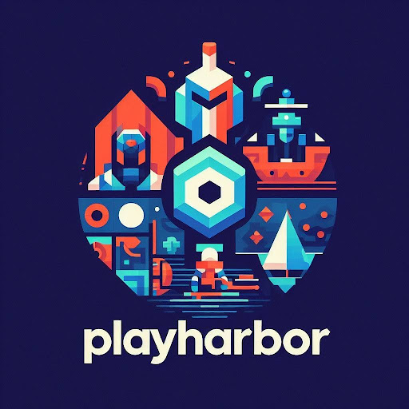
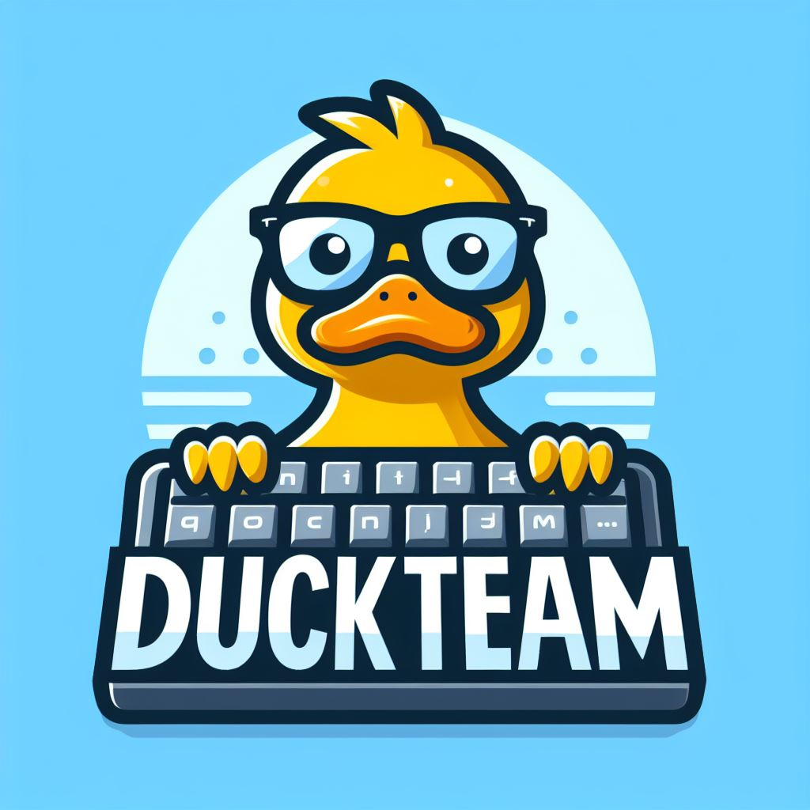

# 🎮 **PlayHarbor: Plataforma de Juegos Sencilla y Divertida**  

  

---

## 🚀 **Descripción del Proyecto**  

**PlayHarbor** es una plataforma web de juegos enfocada en proporcionar una **experiencia de juego sencilla y directa**. Con acceso rápido a múltiples géneros, **PlayHarbor** garantiza que cualquier usuario pueda disfrutar sin complicaciones.  

La plataforma incorpora **sistemas de recompensa** y funcionalidades **sociales** que mejoran la interacción y la experiencia del usuario, creando un entorno dinámico y entretenido.  

Este proyecto ha sido desarrollado para la asignatura de **Proyecto Integral de Ingeniería del Software** de la **UCAM** (Universidad Católica de Murcia).  

---

## 🛠️ **Características Principales**  

- 🎮 **Acceso Rápido a Juegos**: Ofrecemos una variedad de géneros, simplificando el acceso a tus juegos favoritos.  
- 🏆 **Sistemas de Recompensas**: Motiva a los jugadores con logros y premios personalizados.  
- 💬 **Funcionalidades Sociales**: Comparte tus logros, interactúa con amigos y participa en desafíos.  
- 🚀 **Experiencia Directa**: Sin registros complicados ni configuraciones innecesarias.  

---

## 🕹️ **Juegos Personalizados y Rankings**  

- 🎨 **Subida de juegos personalizados**: Los usuarios tienen la posibilidad de **subir y compartir** los juegos que desarrollan en la plataforma, fomentando la creatividad y el talento de la comunidad.  

- 👾 **Juegos creados por el equipo**: Los juegos que puedes disfrutar actualmente en **PlayHarbor** han sido desarrollados por nuestro equipo, asegurando calidad y una experiencia fluida.  

- 🏆 **Cálculo de puntuaciones y rankings**:  
   - El sistema de puntuaciones y los **rankings** globales han sido implementados por nuestro equipo, permitiendo una **competencia justa y emocionante** entre los jugadores.  
   - Los rankings se actualizan automáticamente para que siempre puedas ver quién lidera las tablas de clasificación.
     
---

## 🎥 **Video Demostrativo**  

A continuación, puedes ver un video demostrativo que muestra cómo funciona **PlayHarbor** y sus principales características:  

  

---

## 🖥️ **Equipo de Desarrollo: DuckTeam**  

  

**DuckTeam** es el equipo detrás de PlayHarbor, compuesto por entusiastas del desarrollo y diseño de experiencias digitales.  

---

## 🔒 **Licencia**  

Este proyecto se distribuye bajo una **licencia libre**, pero queda **prohibida su comercialización**. Si utilizas el proyecto, menciona a los autores originales.  

---

## 📧 **Contacto**  

Si quieres saber más sobre el proyecto o necesitas ponerte en contacto con nosotros:  

- 📧 [alvaroniguezfernandez1@gmail.com](mailto:alvaroniguezfernandez1@gmail.com)  

---

¡Esperamos que os guste nuestro trabajo! 🎉  
